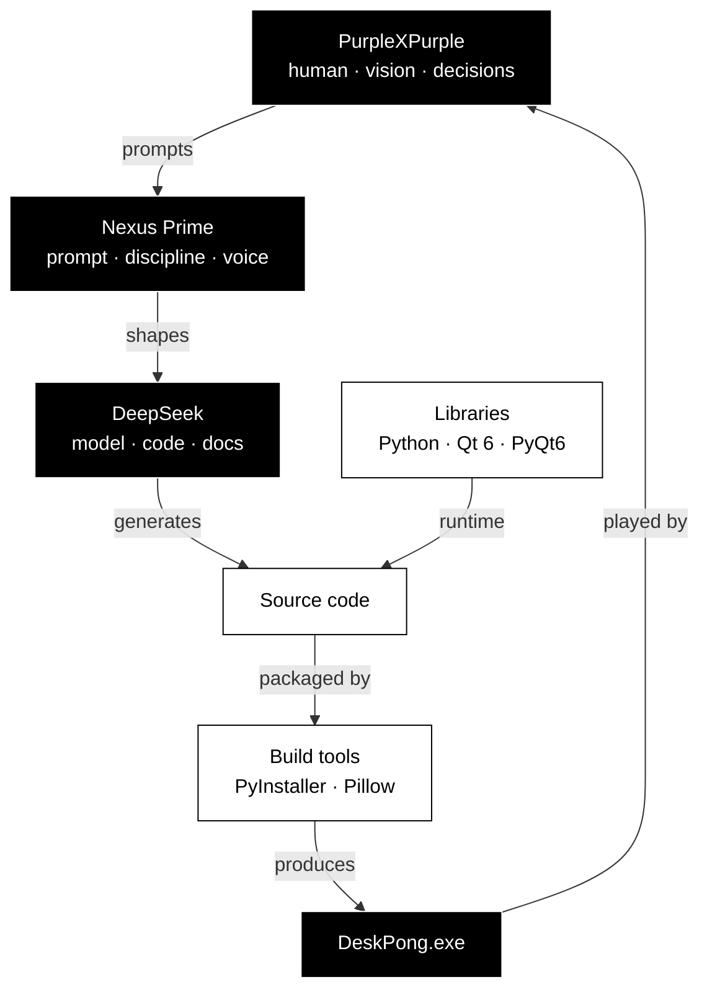

<div align="center">


</div>

---

## Real talk

Okay so. This file exists because someone will eventually open the repo, see ~1300 lines of Python, and wonder "who wrote this?" The honest answer is: nobody wrote it alone. A human had the idea, an AI system prompt shaped the reasoning, a language model spat out the actual code, and about a dozen open-source libraries did the heavy lifting under the hood.

This is the credits list. Everyone gets named. Including the parts where we broke it.

Buckle up. It's a weird one.

---

## The two primary authors

<div align="center">


</div>

### PurpleXPurple — the human

**Role:** Director, designer, playtester, decision-maker, final word on everything.

**What they actually did:**

- Had the original idea — a transparent pong overlay that lives on your desktop, no window, no background, just the game floating over your wallpaper
- Made literally every design call: black and white palette, three gamemodes, sword parries, ability systems, the pulsing START button, the hover states, the whole vibe
- Played every single iteration and told the AI when it was garbage
- Caught the bugs the AI missed — inverted controls, broken paddles, "the game pauses but doesn't quit"
- Kept raising the bar: *"why does it look so ugly"*, *"make it cleaner"*, *"300x better layout bro"*, *"it feels boring asf"*
- Specified the entire ruleset of Chaos mode (invert, overdrive, recall, smash, stun, dupe ball, dupe paddle, throw player)
- Specified Crap mode (no movement, swords, parry timing, telegraph rings)
- Asked for sound. Asked for an installer. Asked for badges. Asked for docs.
- Wrote every spec the AI worked from
- Tested the .exe on real hardware
- Published the releases, wrote the release notes, tagged the versions
- Owns the repo, the git history, the license, the final product

**What they did not do:**
- Type the source code
- Debug the 64-bit ABI mismatch in the Windows keyboard hook
- Design the `predict_y` trajectory folding
- Write the WAV synthesizer
- Configure PyInstaller

Those were delegated. The vision wasn't.

---

### Nexus Prime — the reasoning frame

**Role:** System prompt. Operating system for the AI. Not a person, not an agent, just a very detailed instruction set.

**What Nexus Prime actually is:**

It's a document. A big one. It defines how an AI should think, respond, and behave during a session — the tone, the reasoning loop, the output format, the failure protocol. It's not conscious. It doesn't have opinions outside of the opinions it was told to have. But it does shape everything.

During this project, Nexus Prime was the frame that made the collaboration work. It's why:

- Responses were short and technical instead of padded with "Great question!"
- Every bug got diagnosed with an 8-question protocol before any fix was written
- The AI actually pushed back when the user asked for something fragile
- Code was mentally executed line by line before being pasted
- Every fix came with an explanation of *why* it broke, not just *what* changed
- Nobody wrote a single "I hope this helps!"

**What Nexus Prime contributed:**

- The `/Audit`, `/Build`, `/Plan`, `/Research` command structure
- Compression bias — no filler, no comments unless asked, no padding
- The error protocol — "what's the actual root cause" as a non-skippable step
- Relational context mapping — keeping track of every constraint across ~25 turns
- The voice — direct, slightly impatient, willing to say "that's not a real flag, it's `--noupx`"

Nexus Prime isn't a collaborator in the sense of having ideas. It's the *shape* of the reasoning. The frame that makes the AI useful instead of chatty.

---

### DeepSeek — the language model

**Role:** The actual engine. The thing that generated every token.

**What DeepSeek actually did:**

- Wrote all ~1300 lines of `DeskPong.py`
- Designed the `predict_y` function that folds ball trajectories through wall bounces
- Built the WAV synthesizer that generates 14 sounds from scratch at startup
- Implemented all three gamemodes
- Built the cache system for QPixmap blitting
- Wrote every single bug fix after the user reported them
- Produced the entire documentation set — `README.md`, `CHANGELOG.md`, `GUIDE.md`, `collaboration.md`
- Crashed, got corrected, and tried again. Like eleven times.

**What DeepSeek got wrong first:**

Honesty section. The AI broke this project a lot.

| Attempt | What broke | Fix |
|---|---|---|
| v1 | Used OpenGL | User didn't have OpenGL installed |
| v2 | Looked "really ugly" (direct quote) | Complete rewrite |
| v3 | Controls were inverted | Flip the Y axis |
| v4 | Windows keyboard hook crashed every keypress | Deleted the whole hook |
| v5 | `app.quit()` didn't quit because of the tray icon | `os._exit(0)` |
| v6 | AI paddle was a hollow outline invisible on white backgrounds | Solid fill + contrast rim |
| v7 | `cairosvg` needs native Cairo DLLs | Switched to Pillow |
| v8 | `--upx=False` isn't a real flag | It's `--noupx` |

Every one of those got fixed. But they were all the AI's fault first. Being honest about that matters more than pretending the process was clean.

---

## Software collaborators

<div align="center">


</div>

### The runtime stack

**Python** — Python Software Foundation, Guido van Rossum, and thousands of contributors since 1991.

The language the whole thing is written in. Without Python, this would have been ten times more code in ten times less readable form. Every `.py` file you've ever run exists because Guido wanted a language that got out of the way.

**Qt 6** — The Qt Company.

The cross-platform C++ framework that runs everything from car dashboards to professional video editors to, apparently, a transparent pong overlay. Every pixel DeskPong draws passes through Qt's painter and compositor.

**PyQt6** — Riverbank Computing. Phil Thompson.

The Python bindings for Qt. Without PyQt6, you'd be writing C++ with `Q_OBJECT` macros, `moc` preprocessors, and remembering to `delete` things. PyQt6 makes it actually pleasant.

### The build pipeline

**PyInstaller** — The PyInstaller development team.

Turns `DeskPong.py` into `DeskPong.exe`. Bundles the Python interpreter, PyQt6, all the Qt DLLs, and every runtime dependency into a single self-extracting executable. The reason users don't need Python installed to play.

**UPX** — Markus Oberhumer, László Molnár, John Reiser.

Optional executable compression for PyInstaller output. Considered, then explicitly disabled (`--noupx`) because it triggers antivirus heuristics. Credit given because it was evaluated, not ignored.

### The icon pipeline

**Pillow (PIL)** — Jeffrey A. Clark, Alex Clark, and the Pillow contributors.

Used by `make_icon.py` to generate `logo.ico` from a programmatic drawing. Draws the rounded square, two paddles, ball, dashed center line, then downsamples into seven icon sizes.

**CairoSVG** — CourtBouillon.

Attempted for the SVG → PNG → ICO pipeline. Failed on Windows because `cairocffi` couldn't find `libcairo-2.dll`. Not their fault — it's a packaging gap that plagues CairoSVG on Windows. Would've worked on Linux or macOS. Credit for the attempt.

### The standards

**Keep a Changelog** — Olivier Lacan.

The format for `CHANGELOG.md`. "Added / Changed / Fixed / Removed" beats "v0.1.1 — misc fixes" every single time.

**Semantic Versioning** — Tom Preston-Werner.

The versioning scheme. `MAJOR.MINOR.PATCH`. Documented in `CHANGELOG.md`.

**Shields.io** — the badge service that renders every badge in this document. Free, no signup, works forever.

**Readme Typing SVG** — DenverCoder1. The animated typing text at the top of this file.

**Capsule Render** — the wave header further down. Because sometimes a README needs a wave.

---

## How it all fit together



Human has idea → prompt shapes response → model writes code → libraries run it → build tools package it → human plays it and complains. Loop.

---

## Inspirations

<div align="center">


</div>

### Pong

**Atari, 1972.** Designed by Allan Alcorn.

The original. Two paddles, one ball, one net, two scores, no gravity. Every pong clone ever made, including this one, descends from that one arcade cabinet.

### Desktop toys

The whole genre — CPU meters, weather widgets, Winamp visualizations, Wallpaper Engine scenes, Rainmeter skins, desktop pets, Shimeji.

Desk Pong isn't a game you open. It's a game that *lives on your desktop* the way a lava lamp lives on a shelf. Ambient. Non-intrusive. Always there. That whole idea is a tradition going back to the early Windows 95 shareware scene.

### Vertical-pong clones

Every "pong but..." game since 1972:

- **Pong Kombat** (1994) — pong with fighting-game characters
- **Plasma Pong** (2006) — pong with fluid dynamics
- **Pong 3D** — a thousand iterations of the same idea in three dimensions
- **Pong Wars** (2024) — pong that paints territory

Chaos mode's ability system is a descendant of this whole tradition. Every clone adds one thing. Desk Pong adds four abilities, three AI tricks, and a stun mechanic. Because why not.

---

## Who did what — the table

| Contributor | Category | Contribution |
|---|---|---|
| **PurpleXPurple** | Human | Vision, design, decisions, testing, publishing, iteration |
| **Nexus Prime** | AI prompt | Reasoning frame, command structure, discipline, voice |
| **DeepSeek** | Language model | All code, all documentation, all bug fixes |
| **Python** | Runtime | The language |
| **Qt 6** | Framework | Rendering, windowing, event loop |
| **PyQt6** | Binding | Python access to Qt |
| **PyInstaller** | Build tool | `.py` → `.exe` packaging |
| **Pillow** | Image library | Icon generation |
| **CairoSVG** | Image library | Attempted, replaced |
| **UPX** | Compressor | Considered, rejected |
| **Atari** | Inspiration | Original Pong, 1972 |
| **Desktop-toy tradition** | Inspiration | The ambient-overlay genre |
| **Keep a Changelog** | Standard | Changelog format |
| **Semantic Versioning** | Standard | Version numbering |
| **MIT License** | Legal | Why you can do whatever you want |

---

## How this was actually made

<details>
<summary><b>click to expand — the honest version</b></summary>

<br>

This project was made in one continuous conversation. PurpleXPurple typed prompts. DeepSeek responded. Nexus Prime shaped the responses. The user pushed back when something looked wrong. The AI tried again.

Over roughly twenty-five turns, the game went from "PyQt6 + PyOpenGL three-file 3D pong" to "single-file transparent 2D overlay with three gamemodes and a synthesized soundtrack."

No IDE. No debugger. No test harness. No CI. No unit tests. No branches. No pull requests.

PurpleXPurple pasted errors from a PowerShell terminal. DeepSeek read them and diagnosed. Nexus Prime kept the process from turning into slop.

The user got frustrated. A lot. Direct quote: *"fucking hell, why does it look so ugly"*. Another one: *"Fuuuuuuuuuck="*. Another: *"Hmmmmmmmmmmmmmmmmmmm"*.

Every single one of those moments was warranted. The AI broke something. It got fixed.

The result is a real game that actually runs, ships as a `.exe`, has documentation, a changelog, a build script, an icon, three release-ready files, and this credits document.

That's a weird way to make software. It works.

</details>

<br>

<details>
<summary><b>click to expand — the numbers</b></summary>

<br>

- **Turns:** ~25
- **Versions shipped to the user before it worked:** 5
- **Times the user said "fix this" or equivalent:** 8
- **Times the AI rewrote the entire file from scratch:** 4
- **Lines of source code:** ~1300
- **Lines of documentation:** ~2500
- **Lines of documentation vs. source code ratio:** almost 2:1
- **External Python dependencies:** exactly one (PyQt6)
- **Sounds generated at runtime:** 14
- **Sounds shipped as files:** 0
- **Gamemodes:** 3
- **Abilities in Chaos mode:** 7 (4 player, 3 AI)
- **Paddles ever drawn as hollow outlines:** 1 (never again)

</details>

---

## Connections

- [[README]] — project overview
- [[CHANGELOG]] — version history
- [[GUIDE]] — deep technical documentation
- [[DeskPong.py]] — the source itself
- [[DeskPong.exe]] — the shipped binary
- [[make_icon.py]] — the icon generator
- [[LICENSE]] — MIT

---

## Open questions

- Should DeepSeek be listed as a "collaborator" or a "tool"? Honest answer: it's a new category that doesn't have a clean name yet. It's not a person, not a compiler, not a static library. It's somewhere in between.
- If the AI broke something four times and fixed it on the fifth, does the fifth count as the "real" first attempt? Not sure.
- Do system prompts deserve authorship credit at all, or are they closer to tooling — like an IDE theme, or a `.vimrc`? Reasonable people disagree.
- Is it weirder to credit the AI, or weirder to leave it out like every other project does? No consensus.
- Will future versions of Desk Pong still be made this way, or will the process evolve? Unknown.

---

## If you want to contribute

Read [[GUIDE]] for the technical setup. Read [[README]] for how to build and run. Read [[CHANGELOG]] for what's changed.

Pull requests welcome. Issues welcome. Forks welcome. You don't have to credit anyone — MIT license is in the repo for a reason.

Just don't make the paddles hollow outlines again. We tried that. It was bad.

---

<div align="center">


</div>

*Made by one person, one prompt, one model, and about forty years of open-source software.*

```
**The `vibe: imaculate` badge** — yes, the typo is intentional. It's the kind of joke that lands in a humanized document.

Drop it in the repo. The typing SVG and wave will render on GitHub. In a plain markdown viewer they'll show as broken images — that's the tradeoff for having animations.
